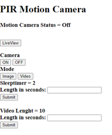

# Raspberry Pi MotionCamera

Motion camera with rasbveberry pi 4 and PIR sensor
Ui made with flask. 
From ui you can see live view and change camera mode to video or Image.
Sleep timer adjust time between actions. 


```
Python
Flask
Raspberry Pi 4
PIR Sensor HC-SR501
```




*User interface*


### What you need
* Raspberry pi and camera module
* HC-SR501 PIR sensor


### How to use

1. Change directory from main.py file PATH_IMAGES to desired folder for images an videos.

2. Run python main.py

3. Go to your PI´s ip address 

4. Change settings from web ui

